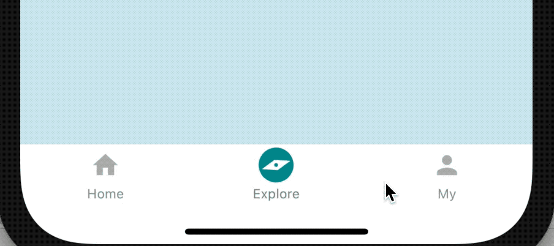
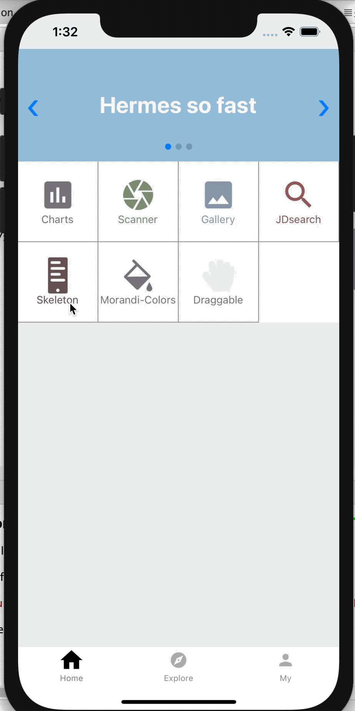
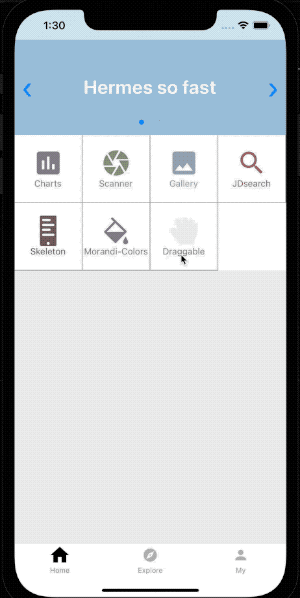
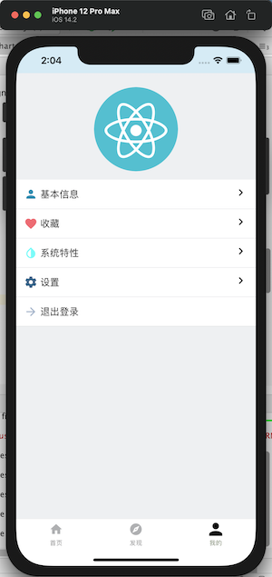
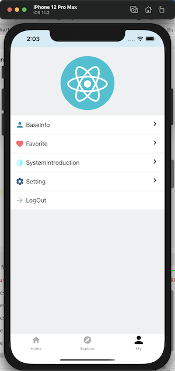
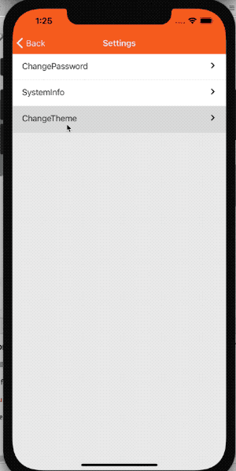
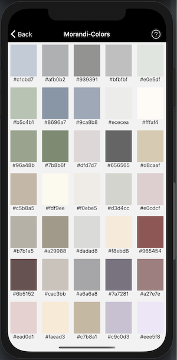

[简体中文](./README.md) | [English](./README_EN.md)

# 项目目的

    1.探索新版本RN特性；
    2.集成组件实验，造自己的轮子！
    3.锻炼自己的架构能力并持续编码和代码优化。
    欢迎加入我们：
    QQ群：783071253
    邮箱：supervons@sina.com
    当前RN版本：0.64.1

# 功能

| 功能名称     | 简述                             | 使用组件名称及版本                                           |
| ------------ | -------------------------------- | ------------------------------------------------------------ |
| 图片选择     | 选择相册中的图片，亦或进行拍照   | react-native-image-picker@2.3.4                              |
| 扫一扫       | 扫一扫二维码，获取二维码中的信息 | react-native-camera@3.8.0                                    |
| 换肤         | 更换系统导航头部及按钮颜色       | react-navigation@3.11.1                                      |
| UI库         | 整体UI库                         | react-native-elements@3.1.0                                  |
| Redux全家桶  | redux及中间件的使用              | redux@4.0.4<br />redux-persist@5.10.0<br />redux-logger@3.0.6<br />redux-thunk@2.3.0 |
| 网络请求     | 统一封装网络请求                 | axios@0.19.0                                                 |
| 基于hook重写 | 基于hook重写class页面            | react@17.0.1                                                 |
| 骨架屏       | 提升列表、页面浏览体验           | react-native-shimmer-placeholder@2.0.7                       |
| 国际化       | app语言切换，随本地系统设置      | react-native-localize@2.0.3 + i18n-js@3.8.0                  |
| 组件可拖拽   | 组件元素随触摸拖拽移动位置       | react-native-draggable@3.3.0                                 |

# 待开发

- [x] 换肤
- [x] 骨架屏
- [x] 多语言支持
- [x] 莫兰迪色卡
- [x] 组件可拖拽支持
- [x] 完善的预览页面
- [ ] 多bundle支持

# 预览
#### 动态tab-bar


#### 骨架屏


#### 组件可拖拽


#### I18国际化


#### 主题换肤


#### 莫兰迪色卡


# 项目结构

```
|-- android	// android 目录
|-- ios	// iOS 目录
|-- src	// 项目文件夹
|   |-- actions	// 接口相关目录
|   |-- common	// 通用配置常量目录
|   |-- components	// 系统级组件目录
|   |-- hook	// 自定义hook目录
|   |-- redux	// redux相关目录
|   |   |-- action
|   |   |-- reducer
|   |   |-- store
|   |-- resource	// 资源目录
|   |-- routers	// 路由导航目录
|   |-- screens	// 系统页面目录
|   |-- styles	// 系统通用样式目录
|   |-- utils	// 系统工具目录
|-- App.js	// 入口文件
|-- buildAndroid.sh	// android打包脚本
|-- package.json	// 这个就不用说了
|-- package-lock.json	// 同上
|-- .prettierrc	// prettierrc 代码格式化目录
```

# 安装依赖

```shell
npm install
# 如果是 iOS 则需要执行以下操作，确保网络畅通
cd ios && pod install 
```

# 运行

    android: react-native run-android
    ios: Xcode选择AwesomeProject.xcworkspace启动

# 测试账号

    用户名：test
    密码：test
